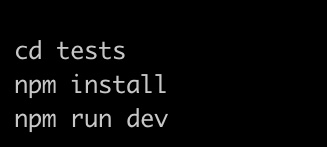
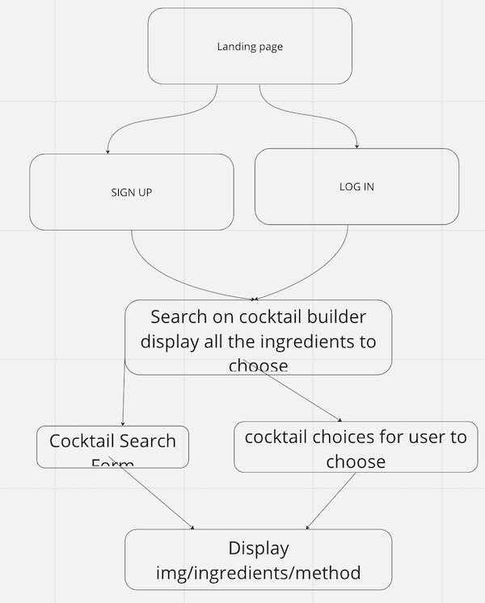

# BARPRETENDER
Project on live [coming soon]
## MOTIVATION
BarPretender is a cocktail recipe app. It has two features. The one feature is that an user can  choose a cocktail from a list to access a recipe. Another feature enables users to select some ingredients they have at hand and list out what cocktails can be made with selected ingredients.
## ABOUT
- Front-end of BarPretender was developed with a JavaScript framework, React.
- Build Tool used for the app is Vite.
- Upon starting on this project, select react for a framework and select Javascript for a variant.

- Go into the director by running cd -filename-.
- Run npm install command.
- To run the localhost server, run npm run dev command in the terminal. URL is localhost:5173, or other numbers that is shown in the terminal.

    
- Dependency used for building this app are  axios 1.4.0, react-dom 18.2.0 and react-router-dom 6.11.1.
- These also need to be installed by running npm install -dependency-name-.
- This is a three page app, the first page being the sign-up and log-in. The second page where the user can select ingredients and acess recipes and the third page is limited to the admin to be able to create/edit/delete recipe list.
## BACKEND
- This project utilisez RAILS as the backend server. The React app hadles the frontend user interface and interactions, while Rails serves as the backend to handle data storage, retrieval and API endpoints.
## PLANNING AND APPROACHES
- BarPredender was a group project built as Project 2 for Software Engineering Immersive course at General Assembly
- As a group we spent some time to plan both backend and frontend together.
this is the working tree we have worked off

    
## FURTHER IMPROVEMENTS
- Currently only the admin can make contributions to the app through create/edit/delete functions. This feature can be extended to the users.
- Further interactions with the user can be implemented. For example user can like/dilike cocktails or can add comments to be more interactive.
- Implement a feature the app chooses random cocktail.
- Implement 'forget username, password' feature.
- Better styling of the app.

## LESSONS LEARNT
- How to work as a team efficiently by taking advantages of the strength of individual collaborators.
- How to use version control- this took a lot of our time and there are improvements to be made to use this  more competently.
- Communication between individual members is crucial to the workflow and goal achievement.
- Acknowledging different ways of programming.
## Credit
[flatiocon](https://www.flaticon.com/) - Provided icons for ingredients list in the app.

We would like to thank each other for working well together by being dedicated team memebers. We would also like to thank the teaching team, cohort and friends to support us to bring this project alive.
